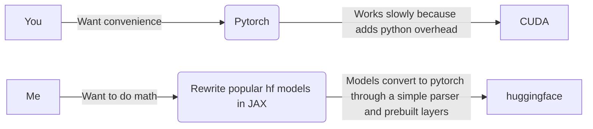

Hi, this package is in development, not ready yet.

It is being tested and most stuff already works.

Needs more layers and archictectures.

Here is how it works:

JAX is fast (because of XLA compilation), works on CUDA and TPU.
This repo implements DiLoCo to use any number of heterogenous compute (kaggle, molab, colab, lightning) without direct connection (only huggingface chekpointing).
